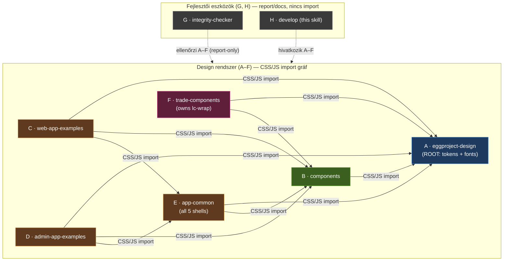

# Skill Family Map — eggproject-design-skills

Full dependency diagram and per-file ownership for the 8-skill family.
Source of truth: `docs/skill-breakdown.md` (Phase 2, FINAL) + the rework tasks T1–T8b
(see git log). The live, data-driven catalog in `docs/report/index.html` (regenerated by
`docs/report/scripts/gen_catalog.py`) is the authoritative per-file count — refresh it after
every structural change. The catalog adds Skill + Kategória (category) filter chips beside
the search box, and its `⚠ csonk` (stub) heuristic is corrected: a component is a stub ONLY
when it has a `.css` but NO `.jsx` AND NO `.html` demo (CSS-only + a `.html` demo = complete).

---

## Dependency DAG

A = dependency root (tokens + fonts + the single preview `_theme.js`). B = component hub.
E sits between B and {C,D} and owns ALL shells (incl. the 5 skeletons). F is self-contained
for trading (owns lc-wrap, vendors lightweight-charts).

---

## Per-Skill Summary

### A — eggproject-design
Design principles + colors_and_type.css (token barrel) + the 17 design showcase preview cards
+ vendored fonts. Owns the ONLY copy of `preview/_theme.js` and `preview/_base.css` (B and
every other skill reference A's copies cross-skill — never duplicated).
`colors_and_type.css` is now a THIN `@import` barrel only — every token now lives in the
modular `tokens/*.css` files: colors, typography, spacing, breakpoints, radius, elevation,
motion, theme-light/dark/auto, theme-toggle. `tokens/breakpoints.css` is the additive 2026
layout layer: viewport breakpoints sm–2xl plus 3xl (1920) / 4xl (2560) for FHD / ultrawide /
4K, large-display container caps (`--ep-layout-max-wide/fhd`), a full-bleed sentinel
(`--ep-layout-max-full: none`), and fluid `clamp()` gutter/section + `--ep-layout-full-height: 100dvh`.
Always import the barrel cross-skill — never a single `tokens/` module.
Key files: SKILL.md, colors_and_type.css, tokens/*.css, theme-tokens.html, assets/(4 svg) + assets/fonts/*.woff2,
preview/_base.css, preview/_theme.js, preview/index.html,
17 showcase cards (brand-construction, brand-logo, brand-logo-inverse, color-dark-theme,
color-neutrals, color-sapphire, color-semantic, color-yolk, spacing-elevation, spacing-layout,
spacing-motion, spacing-radii, spacing-scale, type-body, type-display, type-mono, type-scale),
plus preview/theme-tweaks.html + preview/demo-new-theme-v2.html.
Imports: NONE (dependency root). Vendors fonts only.

### B — eggproject-design-components
52 UI components (full shadcn parity, including the 15 shadcn set finished to css+jsx+html)
+ aggregator styles.css + a SINGLE gallery (`demos/index.html`) + all general JS vendors.
ONE canonical demo per component (the component's own `.html`); no per-component preview
duplicates and no second gallery.
52 component dirs in B: accordion, alert, alert-dialog, aspect-ratio, avatar, badge, breadcrumb,
button, button-group, calendar, card, carousel, charts (BarChart + LineChart), code-block,
collapsible, command-palette, context-menu, data-table, date-picker, divider, dot, drawer, empty,
feed-indicator, file-upload, form-controls, hover-card, input, input-group, input-otp, kbd,
loading, menu, menubar, modal, nav, pagination, popover, resizable, scroll-area, select, skeleton,
slider, splash, stat, stepper, tabs, tag-input, textarea, toast, toggle, tooltip.
Note: lc-wrap and trade-table live in F (NOT in B). dot and feed-indicator are in B (generic atoms).
Vendors: react@18.3.1, react-dom@18.3.1, @babel/standalone, lucide (pinned),
@tanstack/react-table — ALL in B/assets/vendor/. lightweight-charts is NOT in B (moved to F).
B does NOT carry `_theme.js`/`_base.css` — it references A's copies cross-skill.
Imports: A (tokens + fonts + preview `_theme.js`/`_base.css`).

### C — eggproject-design-web-app-examples
Multi-page web-app examples under `examples/` (signin, pricing, onboarding, docs, status,
not-found) + the `marketing-site` multi-page example (now a normal example folder, NOT a ui_kit).
Holds NO shell skeletons — references E's shells.
Imports: A, B (styles.css + JS via B), E (shells via `_shell.css`/`_shell.js`).

### D — eggproject-design-admin-app-examples
Multi-page admin examples under `examples/` (analytics, inbox, billing, settings) + the
`client-portal` multi-page example (now a normal example folder, NOT a ui_kit).
Holds NO shell skeletons — references E's shells.
Imports: A, B (styles.css + JS via B), E (shells via `_shell.css`/`_shell.js`).

### E — eggproject-design-app-common
ALL shells consolidated here: `_shell.css` (.app, .app-tn, .mkt, .docs-*, .focus) + `_shell.js`
+ shells.html + index.html, PLUS the 5 shell-skeleton pages in `skeletons/`
(shell-sidebar, shell-topnav, shell-marketing, shell-docs, shell-focus) — moved out of C/D.
Imports: A, B (component CSS + React/Babel/lucide for shell elements).
Consumed by: C and D.

### F — eggproject-design-trade-components
Owns lc-wrap (LcWrap.jsx + lc-charts.js + lc-wrap.css + lc-wrap.html) and trade-table; demos:
live-trading.html + live-trading-trades.jsx + chart-focus.html + lc-wrap.html.
Vendors lightweight-charts ITSELF (assets/vendor/lightweight-charts.standalone.production.js) —
moved here from B. Uses dot + feed-indicator from B.
Imports: A (tokens), B (dot, feed-indicator, React/Babel/lucide). Does NOT import
lightweight-charts from B (it vendors its own). No CDN.

### G — eggproject-design-skills-integrity-checker
check_integrity script: walks skill dirs, parses @import/<link>/<script src>, reports broken refs.
Imports: none. Scans A-F (report-only, no import edge).

### H — eggproject-design-skills-develop (THIS skill)
SKILL.md (dev rulebook) + _adherence.oxlintrc.json + references/.
Imports: none. References/documents A-F.

---

## Iron Rules (all skills)

1. No CSS duplication between skills — import tokens from A; never copy
   colors_and_type.css into another skill folder (repo-internal rule). The preview
   `_theme.js`/`_base.css` live ONLY in A; reference them cross-skill, never duplicate.
2. No CDN links — vendor general JS locally in B; lightweight-charts is vendored in F; fonts in A.
3. Skills created/modified ONLY via /skill-creator.
4. Do not reinvent existing elements — import from owning skill (lc-wrap/trade-table → F).
5. NO ABBREVIATIONS in CSS class names OR JS identifiers — use full descriptive names
   (e.g. `data-table` not `dt`, `line-chart` not `lc`, `__description` not `__desc`;
   `position`/`index`/`element` not `pos`/`idx`/`el`).
6. Every claim traces to legacy.md or docs/skill-breakdown.md; the live catalog
   (`docs/report/index.html`) is the authoritative per-file count — refresh after each task.
7. Each SKILL.md < 500 lines.
